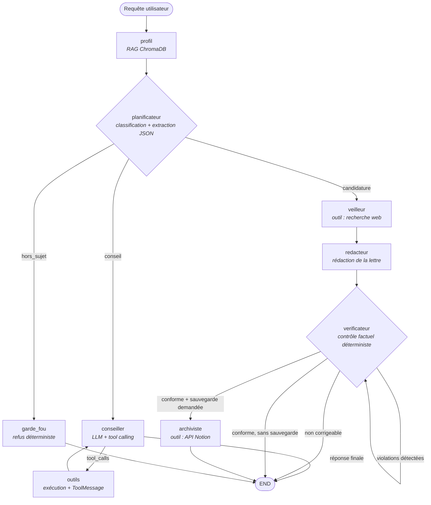

# Copilote de Candidature

Agent conversationnel qui analyse un profil professionnel, enquête sur une entreprise cible,
rédige une lettre de motivation argumentée et archive la candidature dans un Kanban de suivi.

**Le LLM s'exécute entièrement en local** (Llama 3.1 via Ollama) : ni le CV, ni les documents
personnels, ni les lettres générées ne quittent la machine. Seules la requête de veille
(nom d'entreprise) et la fiche de suivi sortent, vers Tavily et Notion.

`Python 3.11` · `LangGraph` · `Ollama / Llama 3.1` · `ChromaDB` · `Tavily` · `Notion API` · `Streamlit` · `Docker` · `pytest`

---

## Architecture

L'orchestration repose sur un **graphe d'état LangGraph non linéaire** : chaque nœud a une
responsabilité unique et écrit dans un état partagé typé (`AgentState`).



| Nœud | Rôle | Appel LLM |
|---|---|---|
| `profil` | Récupère les passages pertinents du CV et des rapports de projet dans ChromaDB | non |
| `planificateur` | Classe l'intention et extrait entreprise / poste / lien / demande d'archivage | oui (T=0) |
| `garde_fou` | Refuse les demandes hors périmètre | non |
| `conseiller` | Répond aux questions de profil et de stratégie, avec accès aux outils | oui (T=0.2) |
| `outils` | Exécute les `tool_calls` et renvoie un `ToolMessage` par appel | non |
| `veilleur` | Recherche les actualités de l'entreprise ciblée | non |
| `redacteur` | Rédige la lettre à partir du profil, de l'offre et de la veille | oui (T=0.3) |
| `verificateur` | Détecte les compétences et chiffres non fondés, fait réécrire | oui, seulement si violation |
| `archiviste` | Crée la fiche Notion avec la lettre complète | non |

### Trois décisions d'architecture

**1. Routage structuré plutôt que tool calling pour l'orchestration.**
Un modèle 8B exécuté en local émet des `tool_calls` valides de façon irrégulière. Faire
reposer tout le pipeline sur ce mécanisme obligeait, en V1, à rattraper les sorties du modèle
avec des expressions régulières sur du JSON écrit en texte libre. Le chemin « candidature »
est désormais déterministe : le LLM décide *quoi* faire (nœud `planificateur`, sortie JSON
validée), le graphe décide *comment* l'exécuter. Le tool calling natif reste en place sur la
branche conversationnelle, où une erreur ponctuelle est sans conséquence.

**2. Le contrôle factuel est déterministe, pas confié au LLM.**
Un modèle 8B recopie volontiers la liste de compétences de l'offre en se
l'attribuant, et cite des chiffres d'entreprise inventés. Lui demander de
relire sa propre lettre revient à confier l'audit à l'auteur. Le nœud
`verificateur` compare donc la lettre au profil par analyse lexicale —
reproductible, instantanée, testée unitairement — et n'appelle le LLM que pour
la réécriture, en lui fournissant la liste exacte des éléments à retirer. Après
`MAX_CORRECTIONS` tentatives infructueuses, la lettre est rendue à
l'utilisateur avec ses défauts signalés plutôt qu'archivée en silence.

**3. Chaque branche est bornée.**
La boucle `conseiller ⇄ outils` est limitée par un compteur d'itérations dans l'état
(`MAX_ITERATIONS`), et le routeur ne se déclenche que sur des `tool_calls` réels — jamais sur
la présence d'un mot-clé dans le texte généré.

---

## Démarrage

### Prérequis

- Docker et Docker Compose
- [Ollama](https://ollama.com) sur la machine hôte, avec les modèles :
  ```bash
  ollama pull llama3.1
  ollama pull nomic-embed-text
  ```
- Une clé [Tavily](https://tavily.com) (veille web) et une intégration Notion — les deux sont
  facultatives : l'agent se dégrade proprement si elles sont absentes.

### Installation

```bash
cp .env.example .env          # puis renseigne TAVILY_API_KEY, NOTION_TOKEN, NOTION_DATABASE_ID
cp mon_cv.pdf data/           # + rapports de projet, portfolio (.pdf, .md, .txt)

docker compose --profile tools run --rm ingest   # indexation du profil
docker compose up --build                        # interface sur http://localhost:8501
```

### En local, sans Docker

```bash
python -m venv .venv && source .venv/bin/activate
pip install -r requirements-dev.txt
make ingest
make run      # interface Streamlit
make cli      # ou interface terminal
```

### Base Notion attendue

| Propriété | Type |
|---|---|
| `Nom` | Titre |
| `Poste` | Texte |
| `Statut` | Statut (avec l'option « À postuler ») |
| `Lien` | URL *(facultatif)* |

---

## Tests

```bash
make test     # pytest + couverture
make lint     # ruff
```

La suite s'exécute **sans réseau et sans Ollama** : le LLM, ChromaDB et les APIs externes sont
simulés. Elle couvre le parsing tolérant des sorties du modèle, les routeurs du graphe, la
détection d'inventions dans la lettre, la boucle de correction bornée, la gestion d'erreur des
outils, le découpage de la lettre pour l'API Notion et la topologie du graphe compilé.

Les cas de régression sont tirés d'échecs réellement observés en exécution : recopie des hard
skills de l'offre, pourcentage d'entreprise halluciné, durée d'expérience inventée.

---

## Sécurité et données personnelles

- Aucun secret dans le code ni dans l'image Docker : tout passe par des variables
  d'environnement, `.env` et `.dockerignore` excluent les fichiers sensibles.
- `data/` (CV, rapports) et `chroma_db/` sont exclus du dépôt : un dépôt public ne doit pas
  contenir de données personnelles indexées.
- Le conteneur tourne avec un utilisateur non privilégié.
- Les résultats de recherche web sont explicitement traités comme des **données** et non comme
  des instructions dans le prompt du rédacteur (atténuation d'injection indirecte).

## Limites connues

- La détection d'inventions repose sur un lexique de technologies : un terme absent de la liste
  passera inaperçu. Le lexique est extensible dans `verification.py`.
- La qualité rédactionnelle reste bornée par celle de Llama 3.1 8B. Le vérificateur garantit
  l'absence de compétences et de chiffres inventés, pas l'élégance du texte — une relecture
  humaine reste nécessaire avant envoi.
- La veille web se limite aux résultats Tavily et n'est pas mise en cache.
- Les propriétés Notion sont attendues avec des noms fixes (`Nom`, `Poste`, `Statut`, `Lien`).

## Structure

```
src/copilote/
├── config.py          # configuration validée par variables d'environnement
├── llm.py             # clients Ollama (chat + embeddings), instanciés paresseusement
├── rag.py             # ingestion multi-documents et récupération
├── parsing.py         # extraction JSON tolérante aux sorties bruitées
├── verification.py    # détection déterministe des inventions dans la lettre
├── tools/             # recherche web (Tavily), archivage (Notion)
├── graph/             # state.py · prompts.py · nodes.py · build.py
├── cli.py             # interface terminal
└── ui.py              # interface Streamlit
scripts/ingest.py      # indexation du profil
tests/                 # suite pytest, sans dépendance réseau
```
